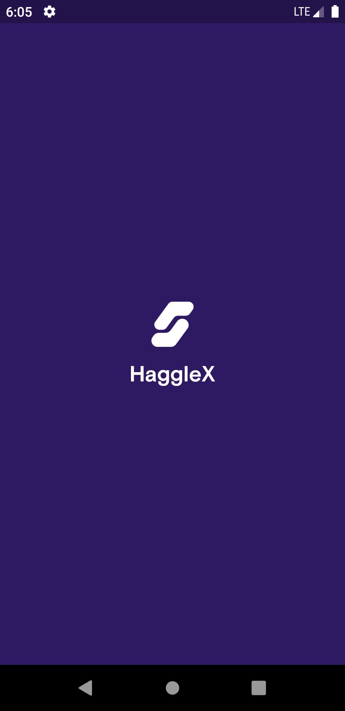
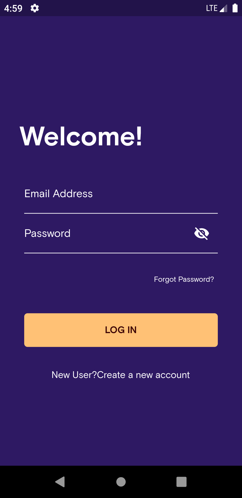
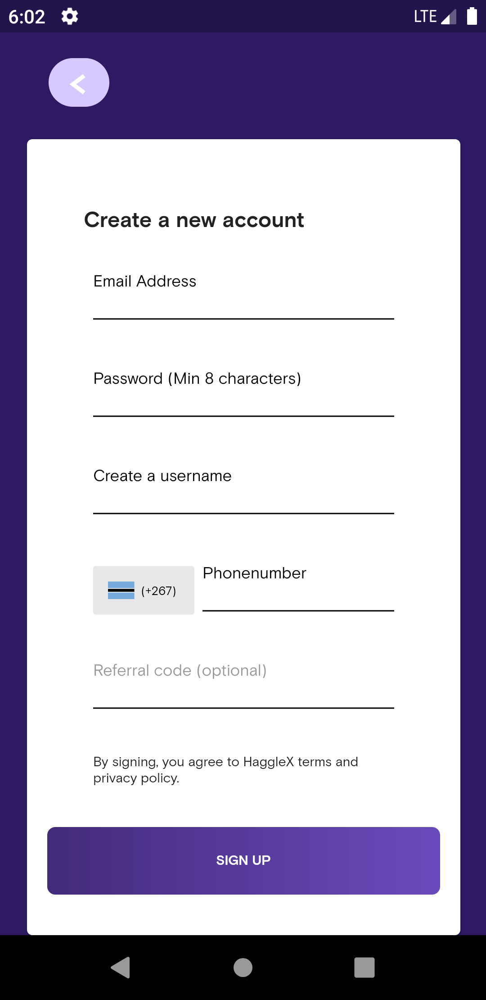
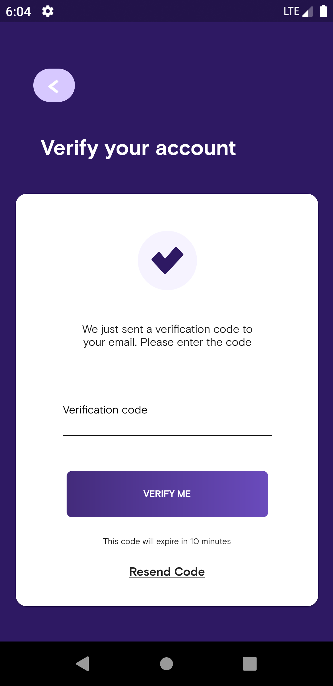
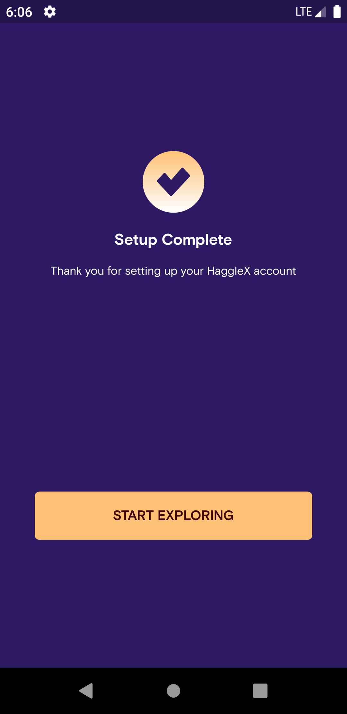
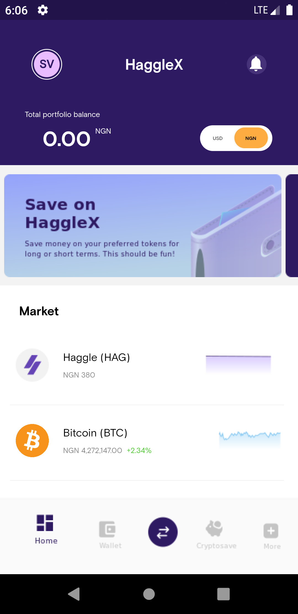

# haggle_x

Buy, sell, save or stake cryptocurrencies, all in one app. HaggleX is a new and easier way to seamlessly take control of your finances.

## Getting Started

This is an Haggle X Mock app

These instructions will get you a copy of the project up and running on your local machine for development and testing purposes.

### Prerequisites

The things you'll need in order to use the app and how to install them

An IDE (Android Studio or VSCode)
Flutter SDK

### How to use

A step by step guide on how to use the app's features

    

    

## Built with

* [Dart + Flutter](https://dart.dev) - The programming language used
* Packages used:
* get:
* gap:
* flutter_svg:
* graphql_flutter:
* flutter_spinkit:

## Authors

<!--* **Alo** - [lsvra.com](https://lsvra.com)-->

See also the list of [contributors](https://github.com/your/project/contributors) who participated in this project.

## License

This project is licensed under the MIT License - see the [LICENSE.md](LICENSE.md) file for details

## Acknowledgments

* Hat tip to anyone whose code was used
* Inspiration
*